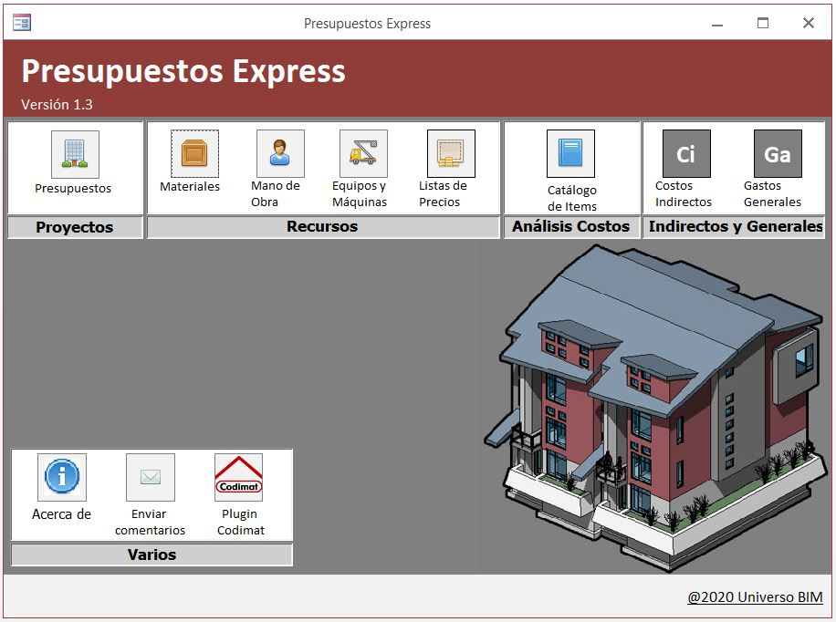

# Presupuestos Express

Presupuestos Express es un programa de bases de datos, completamente gratuito, que permite confeccionar y gestionar los presupuestos de cualquier tipo de proyecto.

## Requerimientos
* Microsoft Windows 7 o superior
* Microsoft Access 2016 en español

## Videos de uso del programa
Lista de videos de YouTube, donde se muestra la forma de uso del programa:

Link: https://www.youtube.com/playlist?list=PL2oVD8kfa97RMg0SGapdCCCKPJe5eVCUt

## Descarga el instalador de la última versión
Link: https://github.com/gorovt/Presupuestos_Express/releases
